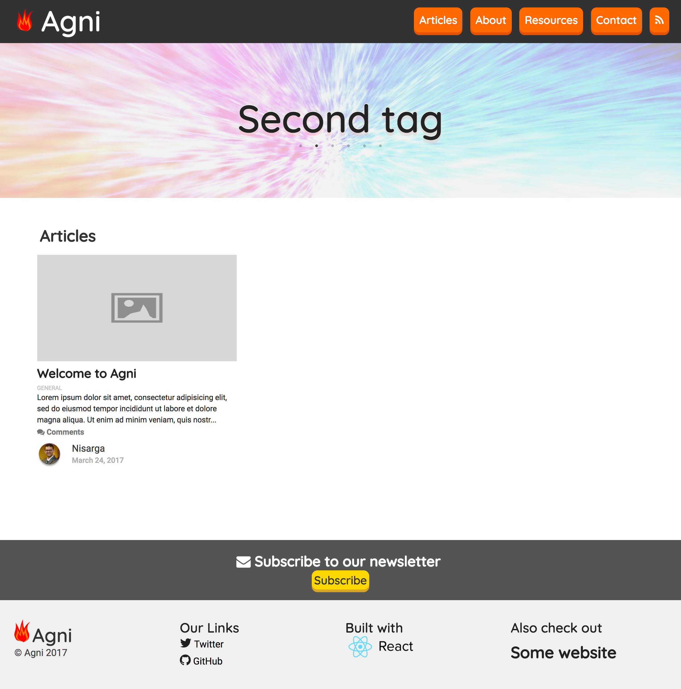

# Agni GatsbyJS Theme

## Introduction

Agni is a GatsbyJS theme that supports Disqus comments, Firebase integration, Mailchimp subscriptions, Bitcoin donations and more.

## Usage

Agni is still in early stages but to get started clone the repo and modify the following files

- config.toml  : holds site config for social links and more
- gatsby-node.js : holds info for RSS feed generation
- components/profileInfo.js : holds info for profile images
- components/BitcoinDonation/ : holds info for Bitcoin donation address
